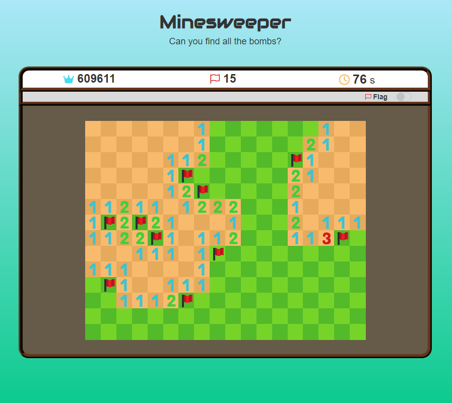
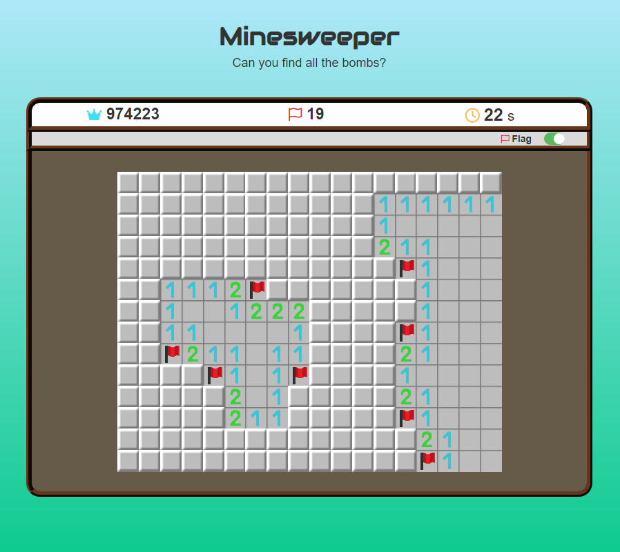

# ENGLISH

## HAX815X_Minesweeper / Des mines et des chiffres

An R library allowing the user to play a game of Minesweeper. There are two ways to play the game: With a graphic interface or in the terminal.

The graphic interface features a colorblind mode, 4 difficulty levels and an original theme by Josselin.

The terminal game is much simpler: Choose a grid size, and simply enter the coordinates of the cells you want to reveal!

### Graphical Game : Installation and Use

<p align="left" display="inline-block">
  
  
</p>

Due to some issues with the pictures, the game is not complete in the package form.  
So please, download the Zip File below and decompress it in a folder.

  https://github.com/EmaCerez/HAX815X_Minesweeper/archive/refs/heads/main.zip
  
 Once un-Zip, open "HAX815X_Minesweeper.Rproj" and enter in the terminal (in R): 
 
 ```
  library(shiny)
  runApp('RR/ManualGame.R')
```  

### Terminal Game : Installation from Git_Hub

If you've already downloaded it from the previous part, this part is optionnal:  

```
  devtools::install_github("EmaCerez/HAX815X_Minesweeper")
  library(HAX815X)
  jouer_partie()
``` 

If you already have it:  

```
  source("RR/sources/Demine.R") #Useless if you've already played once in the other game mode. // Si vous avez déjà joué avec l'interface, cette commande n'est pas néceissaire.
  jouer_partie()
``` 

## Rules 

Come on. Mines on grid. Numbers say how many mines around. Good luck.  

<br/>

---

# FRANCAIS

## HAX815X_Minesweeper / Des mines et des chiffres

Une librairie R permettant à l'utilisateur de jouer une partie de Démineur. Deux jeux de démineurs sont inclus dans le package: Un jeu avec une interface graphique et une version console à laquelle vous pouvez jouer depuis votre terminal.

La version graphique comporte 4 niveaux de difficultés, un mode daltonien et un thème musical original par Josselin.

La version console est beaucoup plus légère : Choisissez simplement une taille de grille et entrez les coordonnées des cases que vous souhaitez révéler !

### Version graphique : Installation et Utilisation

<p align="left" display="inline-block">
  
  
</p>

En raison de certains problèmes avec les images, le jeu n'est pas complet en package.  
Veuillez télécharger le fichier Zip suivant et décompressez-le dans un dossier:

  https://github.com/EmaCerez/HAX815X_Minesweeper/archive/refs/heads/main.zip

Une fois dé-Zippé, ouvrez "HAX815X_Minesweeper.Rproj" et rentrez dans la console en R:

```
  library(shiny)
  runApp('RR/ManualGame.R')
```  

### Version console : Installation depuis GitHub

Si vous avez déjà téléchargé le Zip à la partie précédente, cette partie est optionnelle :

```
  devtools::install_github("EmaCerez/HAX815X_Minesweeper")
  library(HAX815X)
  jouer_partie()
``` 

Si vous l'avez déjà:

```
  source("RR/sources/Demine.R") #Useless if you've already played once in the other game mode. // Si vous avez déjà joué avec l'interface, cette commande n'est pas néceissaire.
  jouer_partie()
``` 

### Règles

Tout est dans le titre.
